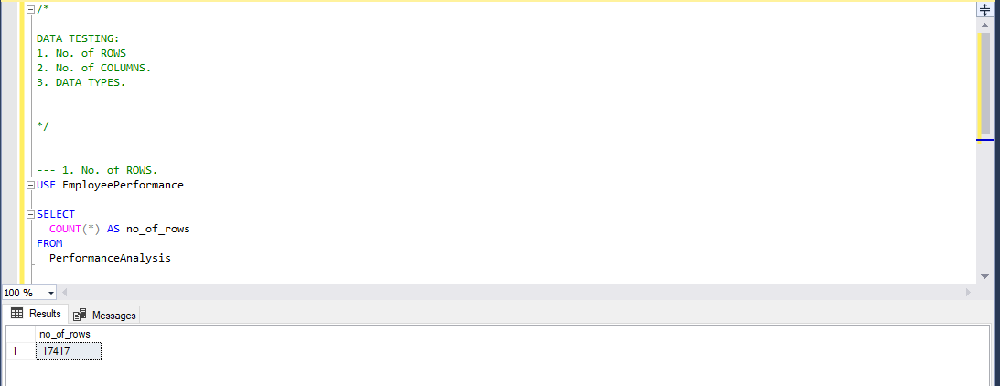
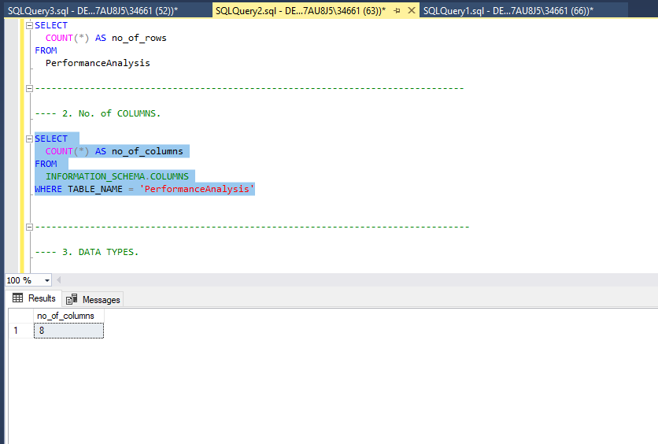
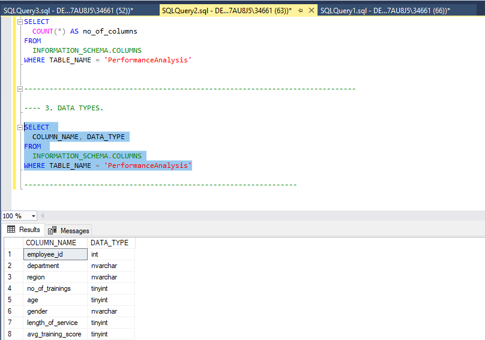
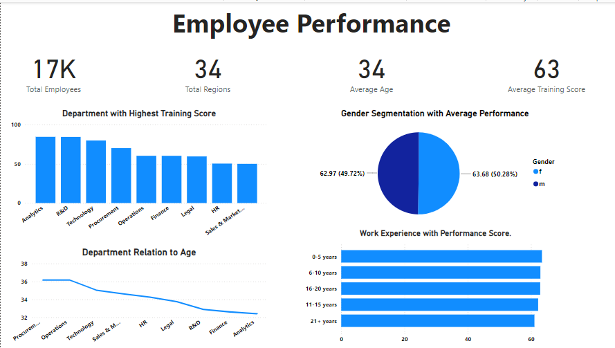
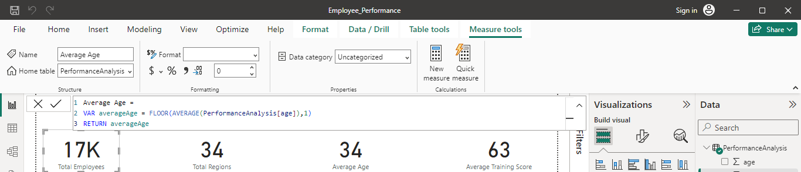
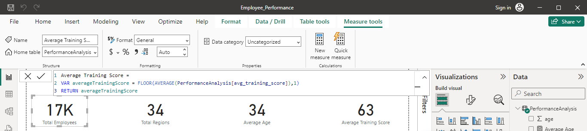
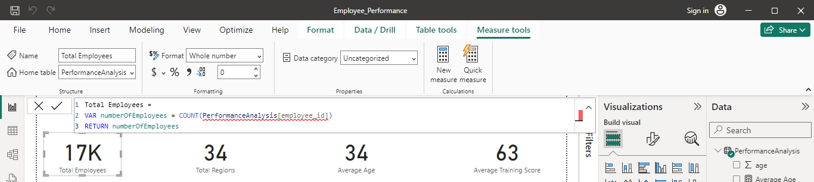
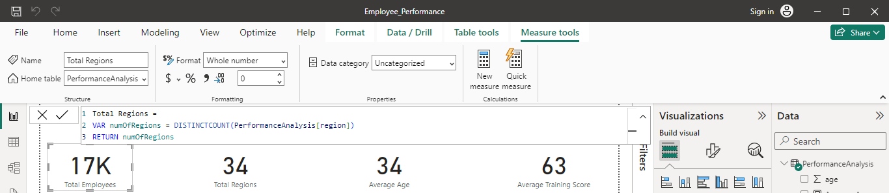
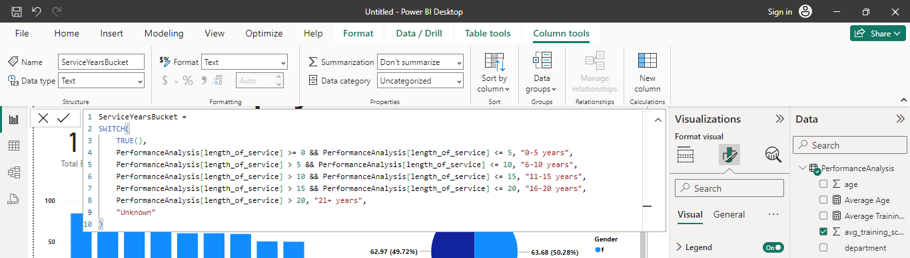

# Data Portfolio


 - Hey there! I'm excited to share with you this comprehensive analysis of employee performance data, transitioning from Excel to PowerBI. This project aims to provide valuable insights into various aspects of employee performance within an organization.


# What You Will Discover

 - In this project, you'll find an in-depth exploration of key areas that are critical for understanding employee performance and improving organizational efficiency. The analysis covers:
   
   - ***1. Highest Average Training Score by Department:*** Identify which department excelled the most in training scores following the company's test.
   - ***2. Variation of Average Age Across Departments:*** Investigate the average age of employees in different departments and understand the age distribution within the organization.
   - ***3. Average Performance Score by Gender:*** Calculate and compare the average performance scores for male and female employees and explore whether there are significant differences between genders.
   - ***4. Correlation Between Tenure and Performance Scores:*** Examine relationship between employees' tenure at the company and their performance scores to uncover any meaningful trends. 

- # What is the ideal solution?

  - I aim to create a dashboard that presents a comprehensive analysis of employee performance data. This dashboard will include insights on the highest average training score by department, the variation of average age across departments, the average performance score by gender and the correlation between tenure and performance scores.

- # Data Source

- Our database is sourced from Kaggle, specifically from an Excel extract available at [this link](https://www.kaggle.com/datasets/fedesoriano/heart-failure-prediction). You can access it here.

-  # Stages

   - Design
   - Development
   - Testing
   - Analysis
 
- ## Design
  
- ### Dashboard components required

- What should the dashboard contain based on the requirements provided?

   - Highest Average Training Score by Department
   - Variation of Average Age Across Departments
   - Average Performance Score by Gender
   - Correlation Between Tenure and Performance Scores


## Tools

## Tools and their purposes

| Tool        | Purpose                                            |
|-------------|----------------------------------------------------|
| Excel       | Exploring the data                                 |
| SQL Server  | Cleaning, testing, and analyzing the data          |
| Power BI    | Visualizing the data via interactive dashboards    |
| GitHub      | Hosting the project documentation and version control |

# Development

## Pseudocode

- What will be our general approach in creating this solution from start to finish?

   1. Get the data from Kaggle.
   2. Explore the data from Excel.
   3. Load the data with SQL.
   4. Clean the data with SQL.
   5. Test the data with SQL.
   6. Visualize the data in Power BI.
   7. Generate the findings based on the insights.
   8. Write the documentation + commentary.
   9. Publish the data to Github Pages.
   

# Data Cleaning

- What do we expect the clean data to look like? (Like what should it contain? What constraints should we apply to it?)

The aim is to refine our dataset to ensure it is structured and ready for analysis.

The cleaned data should meet the following criteria and constraints:

  - Only relevant columns should be retained.
  - All data types should be appropriate for the contents of each column.
  - No column should contain null values, indicating complete data for all records.

  Below is a table outlining the constraints on our cleaned dataset:

    | Property          | Description |
    |-------------------|-------------|
    | Number of Rows    | 17417       |
    | Number of Columns | 8           |  


  Tabular representation of the expected schema for the clean data:


    | Column Name       | Data Type | Nullable |
    |-------------------|-----------|----------|
    | employee_id       | INT       | NO       |
    | department        | NVARCHAR  | NO       |
    | region            | NVARCHAR  | NO       |
    | no_of_trainings   | TINYINT   | NO       |
    | age               | TINYINT   | NO       |
    | gender            | NVARCHAR  | NO       |
    | length_of_service | TINYINT   | NO       |
    | avg_training_score| FLOAT     | NO       |


 # CREATING SQL DATABASE AND VIEW

  ```sql
  -- SQL QUERY CREATION OF DATABASE AND USING IT

  -- CREATION
  CREATE DATABASE EmployeePerformance

  -- USING DATABASE

  USE EmployeePerformance

  -- CREATION OF VIEW

  CREATE VIEW PerformanceAnalysis AS
  SELECT
    employee_id, department, no_of_trainings, age, length_of_service, avg_training_score
  FROM EmployeePerformance

  ```

  
  
# Testing

 - What data quality and validation checks are we going to create?

Here are the data quality tests:

# 1. Row count check

``` sql

SELECT
  COUNT(*) AS no_of_rows
FROM
  PerformanceAnalysis

```



# 2. Column check

``` sql

SELECT
  COUNT(*) AS no_of_columns
FROM
  INFORMATION_SCHEMA.COLUMNS
WHERE TABLE_NAME = 'PerformanceAnalysis'

```




# Data type check

``` sql

SELECT
  COUNT(*) AS no_of_columns
FROM
  INFORMATION_SCHEMA.COLUMNS
WHERE TABLE_NAME = 'PerformanceAnalysis'

```


    
# Visualization

# Results

 - So, how does the dashboard look like?




# DAX Measures I used in by Data Visualization:

# 1. Average Age.



# 2. Average Training Score.



# 3. Total Employees.



# 4. Total Regions.



# New Column I created and used in one of my graphs:




